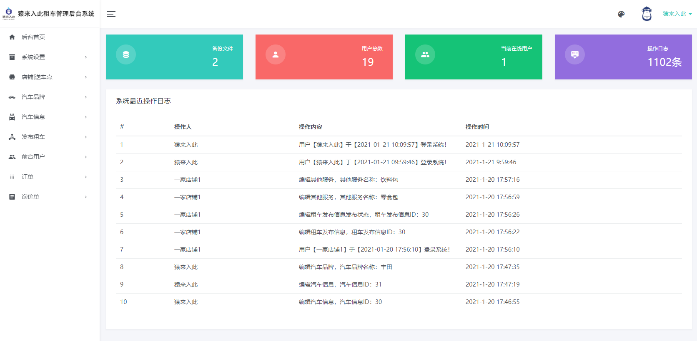
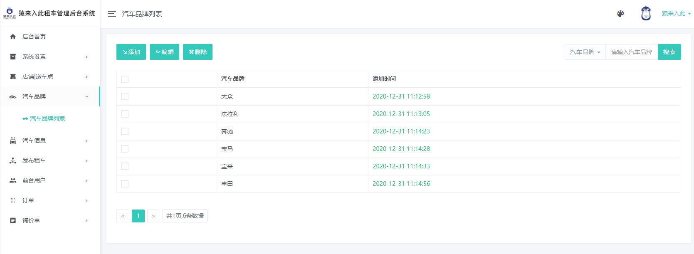
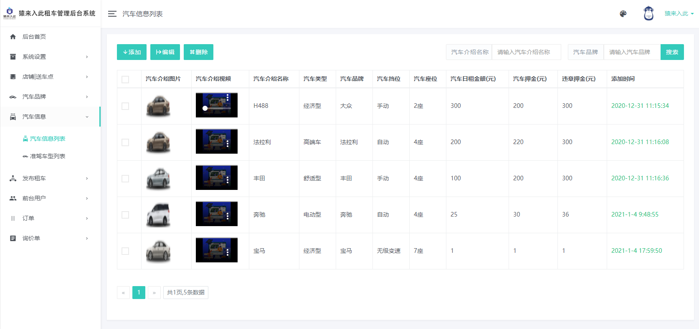

基于Springboot的在线租车系统
=
### 完整代码获取地址：从戎源码网 ([https://armycodes.com/](https://armycodes.com/))
### 作者微信：19941326836  QQ：952045282 
### 承接计算机毕业设计、Java毕业设计、Python毕业设计、深度学习、机器学习
### 选题+开题报告+任务书+程序定制+安装调试+论文+答辩ppt 一条龙服务
### 所有选题地址https://github.com/nature924/allProject

一、项目介绍
---
基于SpringBoot框架，有用户和管理员两个角色，主要功能如下
### 主要实现了普通用户和企业用户在线租车基本操作流程的全部功能，系统分普通用户、企业用户、店铺管理员、超级管理员等角色，除基础脚手架外，实现的功能有：
超级管理员：系统管理、店铺/送车点管理、汽车品牌管理、汽车信息管理、发布租车管理、前台用户（普通用户+企业用户）管理、订单管理、询价单管理等。

店铺管理员：店铺管理员只能管理自己店铺下的汽车信息、订单信息等。

普通用户：注册登录、多条件组合查询车辆信息（车型、品牌、价格、排挡、座位等）、查看车辆信息、在线下单、在线支付、个人信息管理、个人订单查看等。

企业用户：注册登录、提交企业认证信息、企业除了拥有普通用户的权限外，还可根据租赁时间进行打折。

特色功能：前台车辆信息多条件组合查询、车辆支持查看图片和视频、在线支付、企业用户享受折扣等。

二、项目技术
---
- 编程语言：Java
- 数据库：MySQL
- 项目管理工具：Maven
- 前端技术：VUE、HTML、Jquery、Bootstrap
- 后端技术：Spring、SpringMVC、MyBatis

三、运行环境
---
- 操作系统：Windows、macOS都可以
- JDK版本：JDK1.8以上都可以
- 开发工具：IDEA、Ecplise、Myecplise都可以
- 数据库: MySQL5.7以上都可以
- Tomcat：任意版本都可以
- Maven：任意版本都可以

四、运行截图
---

### 程序截图：

